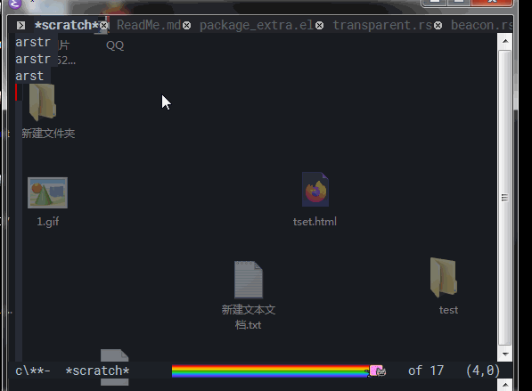
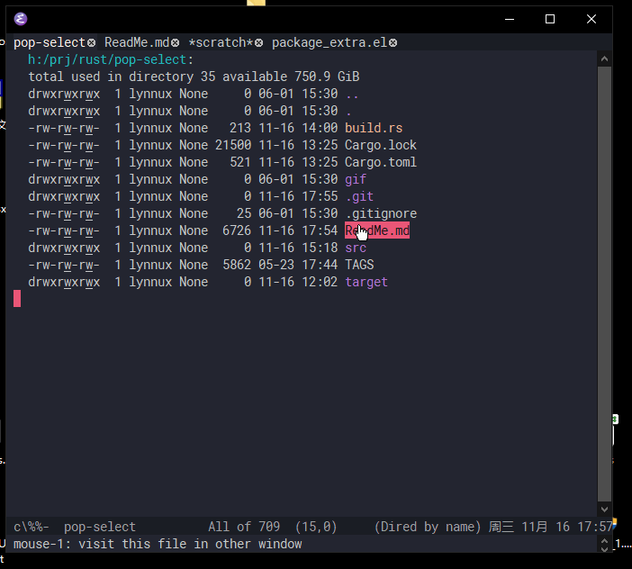

加载
===
```
(ignore-errors (module-load "pop_select.dll全路径，如果没有加入PATH环境变量目录里的话"))
```

编译
===
自行编译的话c++编译器至少需要支持c++17。可以直接用Release里编译好的64位dll。

功能介绍
===
本Emacs module专为windows设计。主要功能有：

(!!文档更新可能不及时，请自行F1 f搜索查看`pop-select/`开头的函数定义)

# 1. 设置Emacs窗口透明 #
有两种方式
- 设置整个emacs透明。
```
(pop-select/transparent-set-all-frame ALPHA) ;; 对所有frame设置透明，ALPHA范围0-255，0全透明，255不透明
(pop-select/transparent-set-current-frame ALPHA) ;; 只对当前frame设置透明，其它同上
```
示例设置：
```
(when (functionp 'pop-select/transparent-set-all-frame)
    (pop-select/transparent-set-all-frame 220))
```
- [**有bug不建议使用!**]设置文字不透明，背景透明。由于实现的限制，该功能打开时会使Emacs置顶，当设置为255即不透明时取消置顶
```
(pop-select/transparent-set-background ALPHA R G B) ;; ALPHA范围0-255，0全透明，255不透明。R G B为rgb拆分数值。
```
示例设置，用CTRL+鼠标滚轮调整当前的透明度：
```
(ignore-errors (module-load "pop_select.dll全路径，如果没有加入bin路径的话"))
(when (functionp 'pop-select/transparent-set-background)
  (defvar cur-transparent 255)
  (defconst step-transparent 20)
  (defun dec-transparent()
    (interactive)
    (setq cur-transparent (min 255 (+ cur-transparent step-transparent)))
    (let* ((rgb (color-name-to-rgb (face-background 'default)))
           (r (round (*(nth 0 rgb) 255)))
           (g (round (*(nth 1 rgb) 255)))
           (b (round (*(nth 2 rgb) 255))))
      (pop-select/transparent-set-background cur-transparent r g b)
      )
    )
  (defun inc-transparent()
    (interactive)
    (setq cur-transparent (max 0 (- cur-transparent step-transparent)))
    (let* ((rgb (color-name-to-rgb (face-background 'default)))
           (r (round (*(nth 0 rgb) 255)))
           (g (round (*(nth 1 rgb) 255)))
           (b (round (*(nth 2 rgb) 255))))
      (pop-select/transparent-set-background cur-transparent r g b)
      ))
  (global-set-key (kbd "<C-wheel-up>") 'dec-transparent)
  (global-set-key (kbd "<C-wheel-down>") 'inc-transparent)
  )
```
后面这种效果图：




# 2. CTRL+TAB弹出窗口选择列表 #
`pop-select/pop-select`弹出一个竖型列表窗口，然后可以按ctrl+tab切换到下一项，ctrl+tab+shift切换到上一项，释放按键后返回所选项给emacs
```
(pop-select/pop-select NAME TO-SEL) ;; NAME为vector列表，TO-SEL是初始选中哪项
```
```
(when (fboundp 'pop-select/pop-select)
  (defun my-pop-select(&optional backward)
    (interactive)
    (let* ((myswitch-buffer-list (copy-sequence (buffer-list)
					        )
                                 )  (vec_name [])
                                    sel
                                    )
      (cl-dolist (buf myswitch-buffer-list)
        (setq vec_name (vconcat vec_name (list (buffer-name buf)))))
      ;; 返回序号
      (setq sel (pop-select/pop-select vec_name (if backward
                                                    (1- (length vec_name))
                                                  1
                                                  )))
      (let ((buf (switch-to-buffer (nth sel myswitch-buffer-list))))
        (when (and (bufferp buf) (featurep 'wcy-desktop))
	  (with-current-buffer buf
	    (when (eq major-mode 'not-loaded-yet)
	      (wcy-desktop-load-file))))
        )
      )
    )
  (global-set-key (kbd "<C-tab>") 'my-pop-select)
  (global-set-key (if (string-equal system-type "windows-nt")
		      (kbd "<C-S-tab>")
	            (kbd "<C-S-iso-lefttab>"))
                  (lambda ()(interactive)
                    (my-pop-select t)))
  )
```
效果图：


# 3. "异步"beacon效果 #
用于替换beacon的闪烁效果，完全不卡Emacs窗口，因为是另起了一个专门的ui线程来画beacon。实现函数`pop-select/beacon-blink`和`pop-select/beacon-set-parameters`
```
(pop-select/beacon-set-parameters WIDTH HEIGHT R G B DURATION-STEP) ;; 可设置宽度，高度，rgb色，以及blink效果显示时间
(pop-select/beacon-blink X Y TIMER DELAY) ;; 在X, Y坐标显示TIMER时长，DELAY是延迟显示时间
```
```
(when (fboundp 'pop-select/beacon-set-parameters)
  ;; 51afef
  (pop-select/beacon-set-parameters 300 20 #x51 #xaf #xef 50)
  (use-package beacon
    :defer 1.5
    :init
    (setq beacon-blink-when-focused t)
    (setq beacon-blink-delay 0.01)
    (setq beacon-blink-duration 0.2)
    (setq beacon-blink-when-window-scrolls nil) ; 开启了auto save，保存时都会闪故而屏蔽
    :config
    (beacon-mode 1)
    (defadvice beacon-blink (around my-beacon-blink activate)
      ;; 目前偶尔不是emacs时也弹窗
      ;; (message (concat (symbol-name this-command) " " (symbol-name last-command)))
      (when (frame-visible-p (window-frame)) ;; 可以阻止最小化时弹窗
        (let ((p (window-absolute-pixel-position)))
          (when p
            (pop-select/beacon-blink (car p) ; x
                                     (cdr p) ; y
                                     (truncate (* beacon-blink-duration 1000)) ; timer
                                     (truncate (* beacon-blink-delay 1000)) ; delay
                                     ))))))
  )
```
效果图跟上面一样：


# 4.开启win10的dark mode(emacs29版本自带，适合29以下版本)
调用`(pop-select/ensure-all-window-dark-mode)`即可，不过目前标题可能不会立即刷新，建议加个`(w32-send-sys-command #xf030)`最大化就可以了

# 5.弹出shell右键菜单
```
(pop-select/popup-shell-menu PATHS X Y) ; PATHS是路径[]，X、Y即屏幕座标，如何都是0，那么会在当前鼠标指针位置弹出。
```

有个问题，首次或者偶尔点击空白处可能不会退出menu，这是正常的，后面都正常了。

参考配置：
```
在dired里用鼠标右键点击文件：
(when (functionp 'pop-select/popup-shell-menu)
    (define-key dired-mode-map (kbd "<mouse-3>") 
      (lambda (event)
        (interactive "e")
        (let ((pt (posn-point (event-end event)))
              path)
          (goto-char pt) ;; 选中指针下的文件
          (setq path (dired-get-filename nil t))
          (unless path ;可能是点击了空白处，那么就取当前目录
            (setq path (dired-current-directory)))
          ;; 路径用/分隔的话弹不出来
          (pop-select/popup-shell-menu (replace-regexp-in-string "/" "\\\\" path) 0 0)
          ))))
```
效果图：


