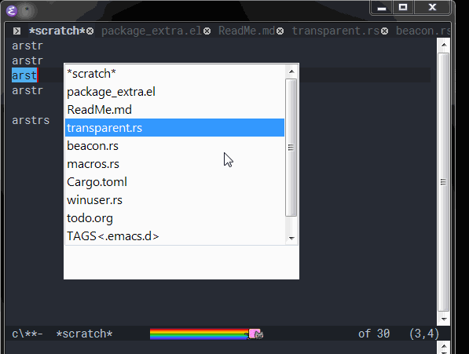

加载
===
```lisp
(when (and (eq system-type 'windows-nt)
           (or (display-graphic-p)
               (daemonp)))
  (ignore-error 'file-missing
    ;; 把 DLL 加到 `load-path' 里.
    (load-library "pop_select.dll")))
```

编译
===
自行编译的话c++编译器至少需要支持c++17。可以直接用Release里编译好的64位dll。

功能介绍
===
本Emacs module专为windows设计。主要功能有：

(!!文档更新可能不及时，请自行F1 f搜索查看`pop-select/`开头的函数定义)

# 1. 设置Emacs窗口透明 #
有两种方式
- 设置整个emacs透明。
```lisp
(pop-select/transparent-set-all-frame ALPHA) ;; 对所有frame设置透明，ALPHA范围0-255，0全透明，255不透明
(pop-select/transparent-set-current-frame ALPHA) ;; 只对当前frame设置透明，其它同上
```
示例设置：
```lisp
(when (functionp 'pop-select/transparent-set-all-frame)
    (pop-select/transparent-set-all-frame 220))
```
- [**有bug不建议使用!**]设置文字不透明，背景透明。由于实现的限制，该功能打开时会使Emacs置顶，当设置为255即不透明时取消置顶
```lisp
(pop-select/transparent-set-background ALPHA R G B) ;; ALPHA范围0-255，0全透明，255不透明。R G B为rgb拆分数值。
```
示例设置，用CTRL+鼠标滚轮调整当前的透明度：
```lisp
(ignore-errors (module-load "pop_select.dll全路径，如果没有加入bin路径的话"))
(when (functionp 'pop-select/transparent-set-background)
  (defvar cur-transparent 255)
  (defconst step-transparent 20)
  (defun dec-transparent()
    (interactive)
    (setq cur-transparent (min 255 (+ cur-transparent step-transparent)))
    (let* ((rgb (color-name-to-rgb (face-background 'default)))
           (r (round (*(nth 0 rgb) 255)))
           (g (round (*(nth 1 rgb) 255)))
           (b (round (*(nth 2 rgb) 255))))
      (pop-select/transparent-set-background cur-transparent r g b)
      )
    )
  (defun inc-transparent()
    (interactive)
    (setq cur-transparent (max 0 (- cur-transparent step-transparent)))
    (let* ((rgb (color-name-to-rgb (face-background 'default)))
           (r (round (*(nth 0 rgb) 255)))
           (g (round (*(nth 1 rgb) 255)))
           (b (round (*(nth 2 rgb) 255))))
      (pop-select/transparent-set-background cur-transparent r g b)
      ))
  (global-set-key (kbd "<C-wheel-up>") 'dec-transparent)
  (global-set-key (kbd "<C-wheel-down>") 'inc-transparent)
  )
```
后面这种效果图：


# 2. CTRL+TAB弹出窗口选择列表 #
`pop-select/pop-select`弹出一个竖型列表窗口，然后可以按ctrl+tab切换到下一项，ctrl+tab+shift切换到上一项，释放按键后返回所选项给emacs
```lisp
(pop-select/pop-select NAME TO-SEL) ;; NAME为vector列表，TO-SEL是初始选中哪项
```
```lisp
(when (fboundp 'pop-select/pop-select)
  (defun my-pop-select(&optional backward)
    (interactive)
    (let* ((myswitch-buffer-list (copy-sequence (buffer-list)
					        )
                                 )  (vec_name [])
                                    sel
                                    )
      (cl-dolist (buf myswitch-buffer-list)
        (setq vec_name (vconcat vec_name (list (buffer-name buf)))))
      ;; 返回序号
      (setq sel (pop-select/pop-select vec_name (if backward
                                                    (1- (length vec_name))
                                                  1
                                                  )))
      (let ((buf (switch-to-buffer (nth sel myswitch-buffer-list))))
        (when (and (bufferp buf) (featurep 'wcy-desktop))
	  (with-current-buffer buf
	    (when (eq major-mode 'not-loaded-yet)
	      (wcy-desktop-load-file))))
        )
      )
    )
  (global-set-key (kbd "<C-tab>") 'my-pop-select)
  (global-set-key (if (string-equal system-type "windows-nt")
		      (kbd "<C-S-tab>")
	            (kbd "<C-S-iso-lefttab>"))
                  (lambda ()(interactive)
                    (my-pop-select t)))
  )
```
效果图：



# 3. "异步"beacon效果 #
用于替换beacon的闪烁效果，完全不卡Emacs窗口，因为是另起了一个专门的ui线程来画beacon。实现函数`pop-select/beacon-blink`和`pop-select/beacon-set-parameters`
```lisp
(pop-select/beacon-set-parameters WIDTH HEIGHT R G B DURATION-STEP) ;; 可设置宽度，高度，rgb色，以及blink效果显示时间
(pop-select/beacon-blink X Y TIMER DELAY) ;; 在X, Y坐标显示TIMER时长，DELAY是延迟显示时间
```
```lisp
(when (fboundp 'pop-select/beacon-set-parameters)
  ;; 51afef
  (pop-select/beacon-set-parameters 300 20 #x51 #xaf #xef 50)
  (use-package beacon
    :defer 1.5
    :init
    (setq beacon-blink-when-focused t)
    (setq beacon-blink-delay 0.01)
    (setq beacon-blink-duration 0.2)
    (setq beacon-blink-when-window-scrolls nil) ; 开启了auto save，保存时都会闪故而屏蔽
    :config
    (beacon-mode 1)
    (defadvice beacon-blink (around my-beacon-blink activate)
      ;; 目前偶尔不是emacs时也弹窗
      ;; (message (concat (symbol-name this-command) " " (symbol-name last-command)))
      (when (frame-visible-p (window-frame)) ;; 可以阻止最小化时弹窗
        (let ((p (window-absolute-pixel-position)))
          (when p
            (pop-select/beacon-blink (car p) ; x
                                     (cdr p) ; y
                                     (truncate (* beacon-blink-duration 1000)) ; timer
                                     (truncate (* beacon-blink-delay 1000)) ; delay
                                     ))))))
  )
```
效果图跟上面一样：


# 4. 开启win10的dark mode(emacs29版本自带，适合29以下版本)
调用`(pop-select/ensure-all-window-dark-mode)`即可，不过目前标题可能不会立即刷新，建议加个`(w32-send-sys-command #xf030)`最大化就可以了

# 5. shell相关功能
弹出shell右键菜单
```lisp
(pop-select/popup-shell-menu PATHS X Y SHOW-EXTRA-HEAD) ; PATHS是路径vector，X、Y即屏幕座标，如果都是0，那么会在当前鼠标指针位置弹出。SHOW-EXTRA-HEAD是不否显示额外的菜单。
```
参考配置，仅供参考，我自用的不会及时更新在这里：
```lisp
(when (functionp 'pop-select/popup-shell-menu)
    (defun get-region-select-path()
      "获取选中的路径，抄的dired-mark和dired-mark-files-in-region"
      (let (paths)
        (when (region-active-p)
          (setq paths [])
          (save-excursion 
            (let* ((beg (region-beginning))
	           (end (region-end))
                   (start (progn (goto-char beg) (line-beginning-position)))
                   (end (progn (goto-char end)
                               (if (if (eq dired-mark-region 'line)
                                       (not (bolp))
                                     (get-text-property (1- (point)) 'dired-filename))
                                   (line-end-position)
                                 (line-beginning-position)))) 
                   )
              (goto-char start)     ; assumed at beginning of line
              (while (< (point) end)
                ;; Skip subdir line and following garbage like the `total' line:
                (while (and (< (point) end) (dired-between-files))
	          (forward-line 1))
                (if (and (not (looking-at-p dired-re-dot))
	                 (dired-get-filename nil t))
                    (setq paths (vconcat paths (list (replace-regexp-in-string "/" "\\\\" (dired-get-filename nil t)))))
	          )
                (forward-line 1))
	      )))
        paths))
    (defun get-select-or-current-path()
      (let ((paths (get-region-select-path))
            current)
        (unless paths
          (setq current (dired-get-filename nil t))
          (when current
            (setq paths [])
            (setq paths (vconcat paths (list (replace-regexp-in-string "/" "\\\\" current)))))
          )
        paths))
    
    (define-key dired-mode-map (kbd "<mouse-3>") 
      (lambda (event)
        (interactive "e")
        (let ((pt (posn-point (event-end event)))
              (paths (get-region-select-path))
              path)
          (if paths
              (pop-select/popup-shell-menu paths 0 0 1)
            ;; 单个文件直接跳过去
            (select-window (posn-window (event-end event)))
            (goto-char pt)
            (setq path (dired-get-filename nil t))
            (unless path         ;可能是点击了空白处，那么就取当前目录
              (setq path (dired-current-directory)))
            (setq paths (vconcat paths (list (replace-regexp-in-string "/" "\\\\" path))))
            ;; 延迟调用使当前选中项更新hl-line等
            (run-at-time 0.1 nil (lambda ()
                                   (pop-select/popup-shell-menu paths 0 0 1)
                                   ))))))
    (defun print-paths(vec)
      (let ((len (length vec))
            (s "")
            (i 0))
        (while (< i len)
          (setq s (concat  s "\n" (file-name-nondirectory (aref vec i)) ))
          (setq i (1+ i)))
        s))
    (define-key dired-mode-map "c" 
      (lambda()
        (interactive)
        (let ((paths (get-select-or-current-path)))
          (when paths
            (pop-select/shell-copyfiles paths)
            (message (concat "Copy: " (print-paths paths)))))))
    (define-key dired-mode-map (kbd "C-w")
      (lambda()
        (interactive)
        (let ((paths (get-select-or-current-path)))
          (when paths
            (pop-select/shell-cutfiles paths)
            (message (concat "Cut: " (print-paths paths)))))))
    (define-key dired-mode-map "v"
      (lambda()
        (interactive)
        (let ((current-dir (dired-current-directory)))
          (when current-dir
            (pop-select/shell-pastefiles current-dir)
            (message "Paste in: %S" current-dir)))))
    )
```
效果图：


shell copy功能，即explorer里按CTRL+C一样的效果：
```lisp
(pop-select/shell-copyfiles PATHS) ; PATHS是路径vector
```

shell cut功能，即explorer里剪切功能：
```lisp
(pop-select/shell-cutfiles PATHS) ; PATHS是路径vector
```

shell paste功能，即explorer里的CTRL+V一样的效果：
```lisp
(pop-select/shell-pastefiles PATH) ; PATH目标路径
```
# 6. 类似neovide的光标移动效果
```
(pop-select/beacon-animation X Y W H TIMER STEP R G B DIFF-MIN)
X: 坐标x值
Y: 坐标y值
W: 光标宽度
H: 光标高度
TIMER: 动画持续时间
STEP: 动画持续时间按多少份处理
R: 光标颜色RGB的R值
G: 光标颜色RGB的G值
B: 光标颜色RGB的B值
DIFF-MIN: 坐标差值最小值，小于这个值就不显示动画，可以排除光标小范围移动时显示动画

注意R G B不能设置为0 0 0即黑色，这是透明色会看不见
```
配置参考：
```lisp
(when (fboundp 'pop-select/beacon-animation)
  (defun show-cursor-animation ()
    (ignore-errors
      (let* ((p (window-absolute-pixel-position))
             (pp (point))
             (w
              (if (equal cursor-type 'bar)
                  1
                (if-let ((glyph
                          (when (< pp (point-max))
                            (aref
                             (font-get-glyphs
                              (font-at pp) pp (1+ pp))
                             0))))
                  (aref glyph 4)
                  (window-font-width))))
             (h (line-pixel-height)))
        (when p
          (pop-select/beacon-animation
           (car p) ; x
           (if header-line-format
               (- (cdr p) h) ;; 修复开启`header-line-format'时y值不正确
             (cdr p)) ; y
           w h
           140 ; timer
           60 ; timer step
           233 86 120 ; r g b
           20 ; diff min，根据自己需要试验
           )))))
  (add-hook 'post-command-hook 'show-cursor-animation))
```

<details>
  <summary>根据背景色调整光标的残影的颜色</summary>

```lisp
;;; -*- lexical-binding: t; -*-

(require 'cl-lib)

(when (and (eq system-type 'windows-nt)
           (or (display-graphic-p)
               (daemonp)))
  (ignore-error 'file-missing
    ;; 把 DLL 加到 `load-path' 里.
    (load-library "pop_select.dll")))

(with-eval-after-load "pop_select.dll"
  (let ((cursor-animation-color-R 0)
        (cursor-animation-color-G 0)
        (cursor-animation-color-B 0)
        cursor-animation?)  ; 是否开启光标残影.
    (add-hook 'window-scroll-functions
              (lambda (_window _position)
                "滚屏时关闭残影: 1. 节约性能; 2. 设置 `scroll-margin' 后, 滚屏时残影位置不准确."
                (setq cursor-animation? nil)))
    (add-hook 'post-command-hook
              (lambda ()
                (when-let ((window-absolute-pixel-position
                            (when (or cursor-animation?
                                      (eq this-command 'recenter-top-bottom))
                              (window-absolute-pixel-position))))
                  (let ((line-pixel-height (line-pixel-height)))
                    (pop-select/beacon-animation
                     (car window-absolute-pixel-position) (if header-line-format
                                                              (- (cdr window-absolute-pixel-position)
                                                                 line-pixel-height)
                                                            (cdr window-absolute-pixel-position))
                     (if (eq cursor-type 'bar)
                         1
                       (if-let ((glyph (let ((point (point)))
                                         (when (< point (point-max))
                                           (aref (font-get-glyphs (font-at point)
                                                                  point (1+ point)) 0)))))
                           (aref glyph 4)
                         (window-font-width))) line-pixel-height
                     180 100
                     cursor-animation-color-R cursor-animation-color-G cursor-animation-color-B
                     ;; 排除大约是单个半角字符的距离:
                     24)))
                (setq cursor-animation? t)))
    (letrec ((cursor-animation-color-setter
              (lambda ()
                (remove-hook 'server-after-make-frame-hook cursor-animation-color-setter)
                (let ((cursor-animation-color-RGB
                       (cl-mapcar (let* ((ratio 0.5)  ; 只需要修改此值.
                                         (1-ratio (- 1 ratio)))
                                    (lambda (cursor-color default-color)
                                      "按照 ratio:(1-ratio) 的比例混合光标颜色和背景色."
                                      (floor (* (+ (*   ratio  cursor-color)
                                                   (* 1-ratio default-color))
                                                255.9999999999999))))
                                  (color-name-to-rgb (face-background 'cursor))
                                  (color-name-to-rgb (face-background 'default)))))
                  (setq cursor-animation-color-R (cl-first  cursor-animation-color-RGB)
                        cursor-animation-color-G (cl-second cursor-animation-color-RGB)
                        cursor-animation-color-B (cl-third  cursor-animation-color-RGB))))))
      ;; 如果是 daemon, 则必须等到第一个 visible frame 创建之后再设置残影的颜色.
      (add-hook 'server-after-make-frame-hook cursor-animation-color-setter)
      (unless (daemonp)
        ;; 如果不是 daemon, 确保大部分有关 face 的设置生效后再设置残影的颜色.
        (add-hook 'emacs-startup-hook cursor-animation-color-setter 90))
      (when (eq this-command 'eval-buffer)
        ;; 若要测试本文件, 直接将其拷贝到单独的 buffer, 然后执行 `eval-buffer'.
        (funcall cursor-animation-color-setter)))))
```

</details>

效果图：


